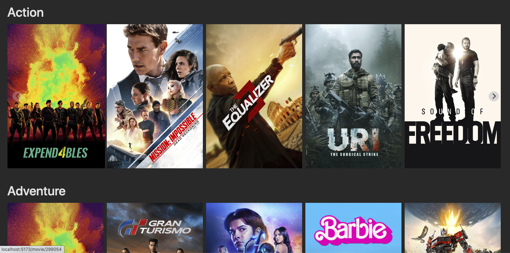
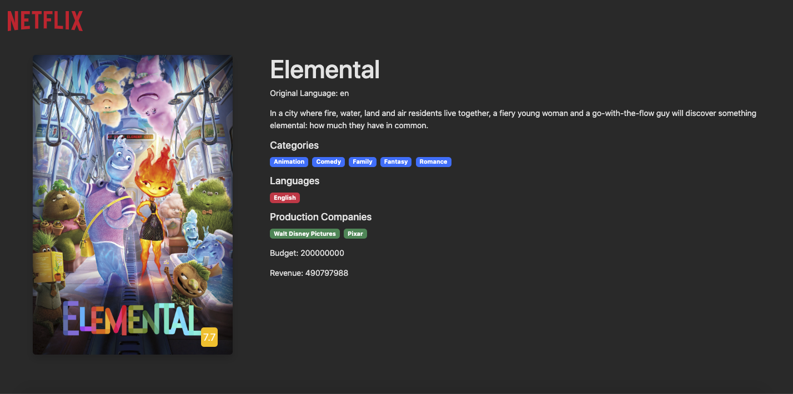

#Netflix-Clone-Redux-Thunk

#Libraries Used:

-react-router-dom

-redux

-react-redux

-redux-thunk

-axios

-@splidejs/react-splide

#Sources

API: https://developer.themoviedb.org/reference/changes-tv-list

## SCREEN GIF

## SCREEN VIEW

## React Router DOM:

Description: React Router DOM is a library for handling navigation and routing in React applications. It enables declarative routing, allowing you to define how the UI should change in response to a change in the URL.
Key Features:
Declarative routing using components like BrowserRouter, Route, Link, etc.
Support for nested routes and route parameters.
Easily integrates with React applications for building single-page applications (SPAs).

## Redux:

Description: Redux is a predictable state container for JavaScript applications, commonly used with React. It helps manage the state of an application in a more organized and centralized manner.
Key Concepts:
Store: Holds the state of the application.
Actions: Describes changes to the state.
Reducers: Specify how the state changes in response to actions.
Middleware: Enhances Redux's behavior, used for tasks like asynchronous operations.

## React Redux:

Description: React Redux is the official React bindings for Redux. It provides a set of wrapper components that connect the Redux store with React components, making it easier to integrate Redux into a React application.
Key Components:
Provider: Wraps the application, making the Redux store accessible to all components.
connect: A higher-order component that connects React components to the Redux store.

## Redux Thunk:

Description: Redux Thunk is middleware for Redux that enables handling asynchronous logic in Redux actions. It allows action creators to return functions instead of plain action objects.
Use Cases:
Making asynchronous API requests and handling the responses.
Delaying the dispatch of an action.
Complex logic before dispatching actions.

## Axios:

Description: Axios is a promise-based JavaScript library for making HTTP requests in browsers and Node.js. It simplifies the process of sending HTTP requests and handling responses.
Key Features:
Supports the Promise API.
Interceptors for request and response handling.
Automatic transformation of JSON data.

## @splidejs/react-splide:

Description: @splidejs/react-splide is a React wrapper for Splide, a lightweight and responsive slider/carousel library. It allows you to create customizable and interactive sliders in your React applications.
Key Features:
Responsive design for various screen sizes.
Touch and drag support for mobile devices.
Easy customization of appearance and behavior.

These libraries are fundamental to building modern React applications, offering solutions for navigation, state management, asynchronous actions, HTTP requests, and interactive UI components like sliders.
